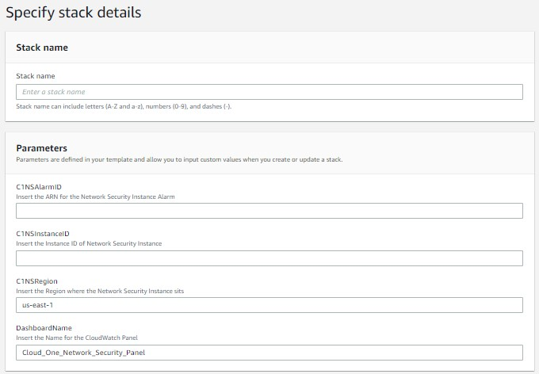
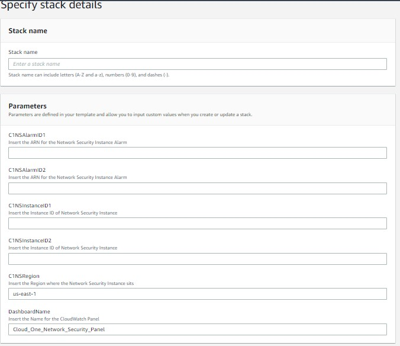
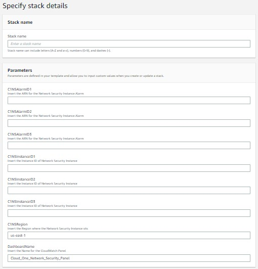
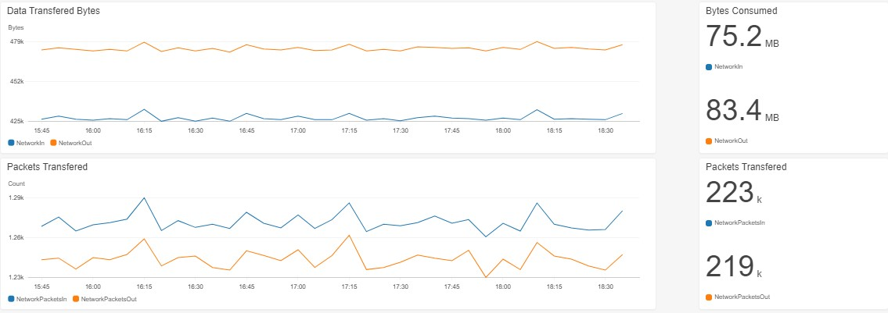
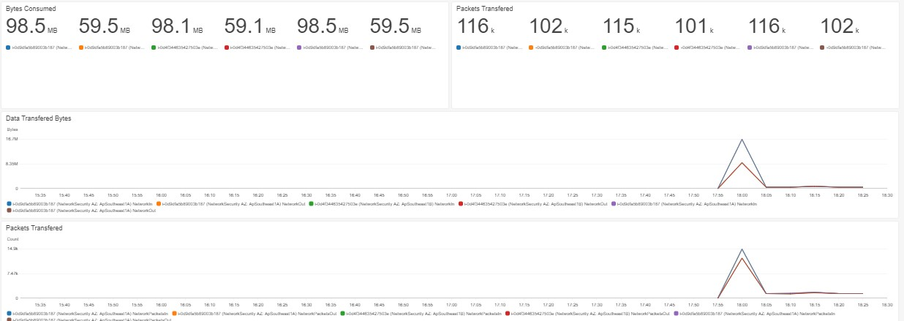

# CloudWatchDashboardC1NS

O Cloud One Network Security é IPS que inspeciona o tráfego de rede na sua infra em nuvem.

Mais informações aqui: https://github.com/SecurityForCloudBuilders/SegurancaParaNuvem

Um exemplo de dashboard para monitorar o tráfego de rede, todas as configurações são feitas no CloudFormation Wizard.

Sobre o CloudFormation: https://aws.amazon.com/pt/cloudformation/

 </img>

 </img>

 </img>

 </img>

 </img>
